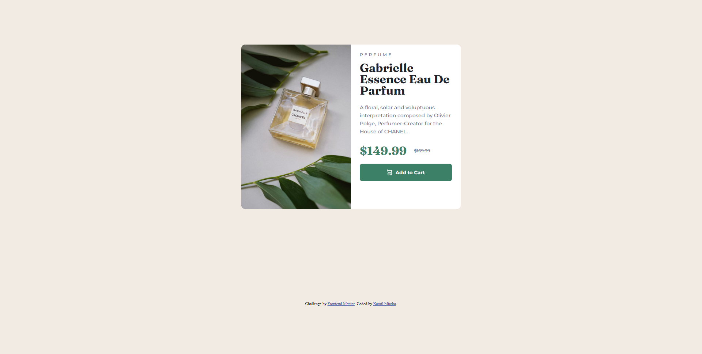
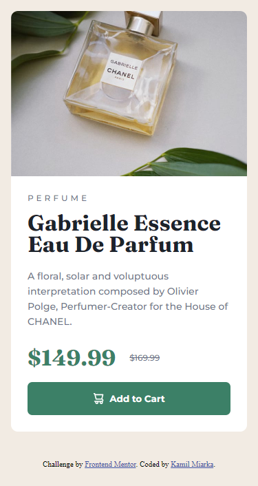

# Frontend Mentor - Product preview card component solution

This is a solution to the [Product preview card component challenge on Frontend Mentor](https://www.frontendmentor.io/challenges/product-preview-card-component-GO7UmttRfa). Frontend Mentor challenges help you improve your coding skills by building realistic projects. 

## Table of contents

- [Overview](#overview)
  - [The challenge](#the-challenge)
  - [Screenshot](#screenshot)
  - [Links](#links)
- [My process](#my-process)
  - [Built with](#built-with)
  - [What I learned](#what-i-learned)
  - [Useful resources](#useful-resources)
- [Author](#author)

## Overview

### The challenge

Users should be able to:

- View the optimal layout depending on their device's screen size
- See hover and focus states for interactive elements

### Screenshot




### Links

- Solution URL: [Add solution URL here](https://your-solution-url.com)
- Live Site URL: [Add live site URL here](https://your-live-site-url.com)

## My process

- The first problem was make it load the righ image depending on the avaliable screen width resoultion. I used <source media> solution described at https://developer.mozilla.org/en-US/docs/Learn/HTML/Multimedia_and_embedding/Responsive_images

- I measured the original template and wrote the html, css code


### Built with

- Semantic HTML5 markup
- CSS custom properties
- Flexbox
- CSS Grid
- Mobile-first workflow

### What I learned

I can tell the browser to load selected image depending on the conditions met by <source media> tag. It can be useful for responsive sites. 

```html
<picture>
  <source media="(max-width: 620px)" srcset="images/image-product-mobile.jpg">
  
</picture>
```

### Useful resources

- [Responsive Images in HTMK](https://developer.mozilla.org/en-US/docs/Learn/HTML/Multimedia_and_embedding/Responsive_images) - Tutorial how to use source media

## Author

- [Website](https://kamilmiarka.pl)
- [FrontEnd Mentor](https://www.frontendmentor.io/profile/kam33l)
