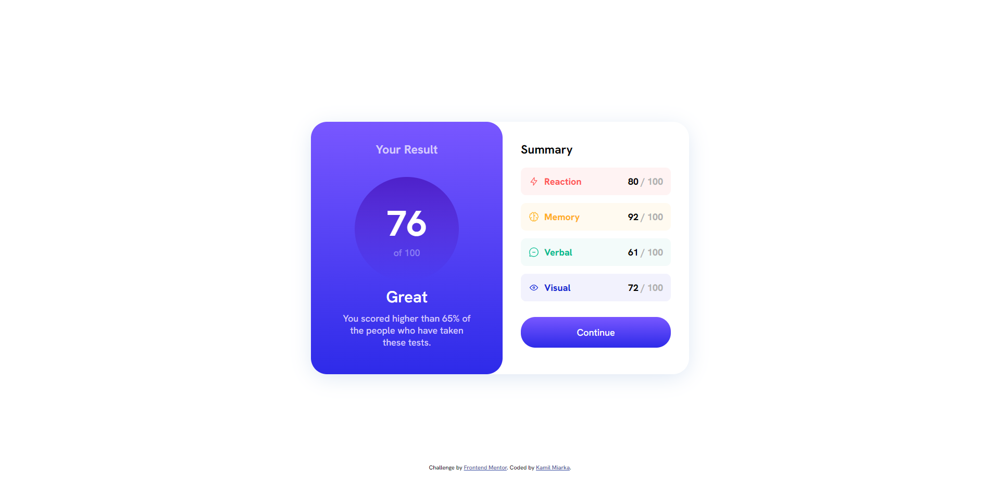
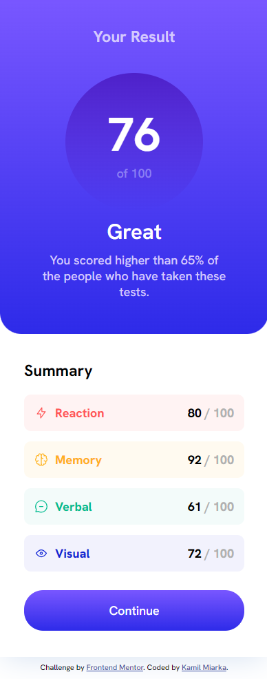

# Frontend Mentor - Results summary component solution

This is a solution to the [Results summary component challenge on Frontend Mentor](https://www.frontendmentor.io/challenges/results-summary-component-CE_K6s0maV). Frontend Mentor challenges help you improve your coding skills by building realistic projects. 

## Table of contents

- [Overview](#overview)
  - [The challenge](#the-challenge)
  - [Screenshot](#screenshot)
  - [Links](#links)
- [My process](#my-process)
  - [Built with](#built-with)
  - [What I learned](#what-i-learned)
- [Author](#author)

## Overview

### The challenge

Users should be able to:

- View the optimal layout for the interface depending on their device's screen size
- See hover and focus states for all interactive elements on the page

### Screenshot

### Links

- Solution URL: (https://github.com/kam33l/frontendmentor-challenges/tree/main/results-summary-component-main)
- Live Site URL: (https://frontendmentor-challenges-kam33l.vercel.app/results-summary-component-main/index.html

## My process

- I used grid to center component
- FlexBox to style data inside

### Built with

- Semantic HTML5 markup
- CSS custom properties
- Flexbox
- CSS Grid

### What I learned

- How to order elemets with CSS Grid and Flex
- How to set and use CSS custom properties
- Making responsive components

## Author

- [Website](https://kamilmiarka.pl)
- [FrontEnd Mentor](https://www.frontendmentor.io/profile/kam33l)
